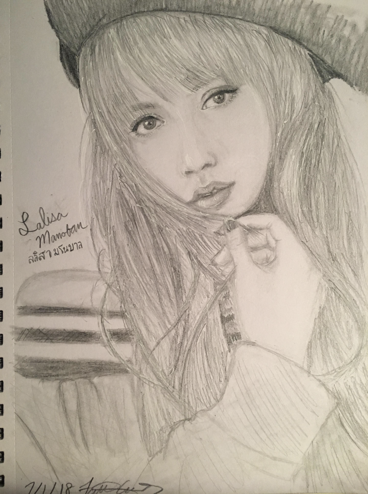
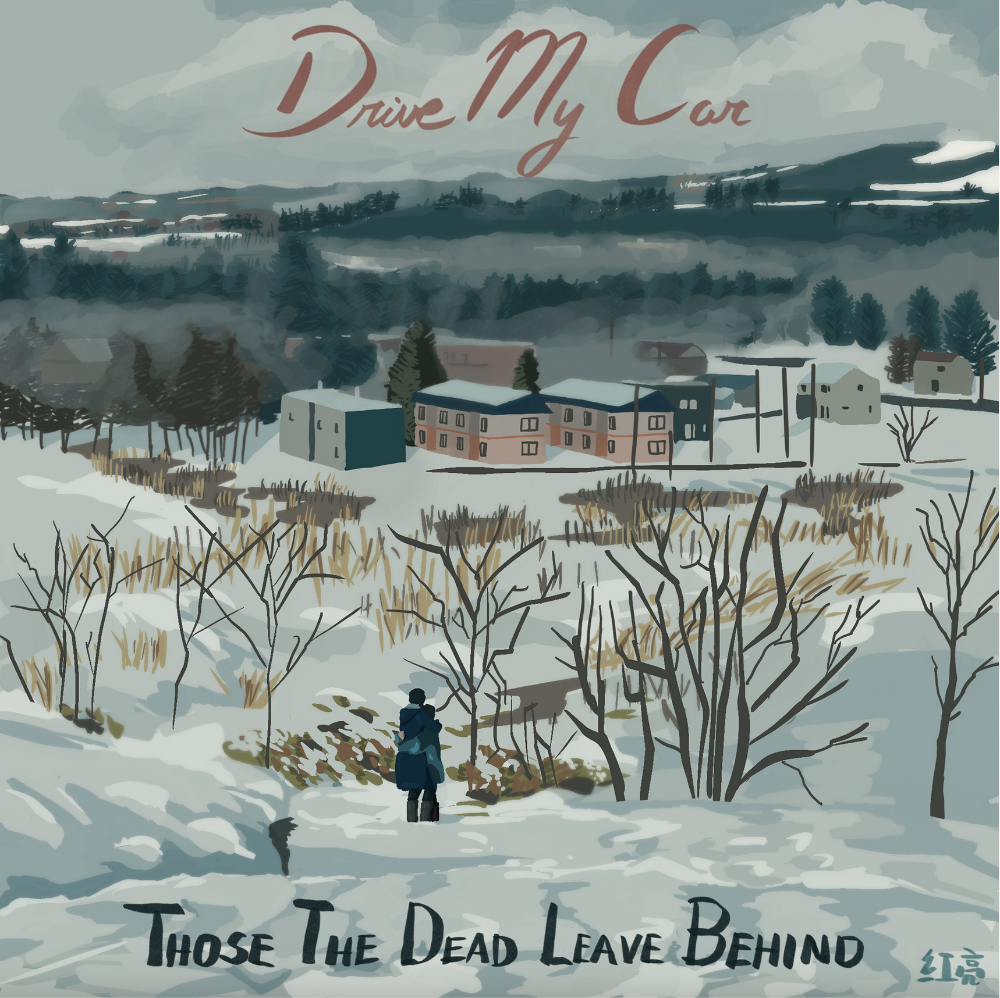

# Art Page
## Navigation Links
|[Home](README.md) | [Photography](Photography.md)| [Art Portfolio](https://faithcarter.myportfolio.com/art)
| -------- | --------| -------- | 

**Background**   
>I started creating art when I was young. Whether it be drawing horses or my friends, I really enjoyed being able to create. I was not serious about creation until late middle school where I started creating art as an outlet. Art, for me, was something to distract myself or give myself a break. I worked heavily on improving hand-eye coordination, and, by early high school, I was pretty accurate with portrait sketches and extremely accurate at drawing eyes. Although, this did not make me that happy. Sketches are fun and a great learning tool, but what I really enjoyed was painting.

**Traditional Art**  
No one is good at painting overnight, and I did not start seeing paintings I liked until about junior year of high school. I found that hyper-realism is not my style, and that color matching is. I also started going from painting people to painting scenery. Painting people is fun, it is a great challenge, but it is easier to see the flaws in the painting. Not that I do not like seeing my flaws in painting, but sometimes it would get to the point where I would spend hours trying to fix something on a practice portait. I have started to paint more scenery now, and I have found that I like that much more than people. I stopped drawing people around 2021.

**Scenery Examples:** 
|2017: Interstellar|2020: Arrietty Scene|2023: House from Kiki's Delivery Service|
| -------- | --------| -------- | 
| |  | |

**Portrait Examples:** 
|2018: Lisa from BlackPink|2020: Irene and Seulgi from Red Velvet|2021: Me|
| -------- | --------| -------- | 
| |  | |

**Digital Art**  
It took me awhile to convince myself to actually create with digital art because found the learning curve of digital art to be horrendous. My issue was that when you get too used to your paint brushes and pencils, it is hard to imagine their feel on a cold, uniform, Apple Pencil. I eventually forced myself to imagine painting and, for the most part, it has worked okay. Sometimes I think my pieces could be improved by using the special digital effects that Procreate offers, but I was never that good at understanding how those work. I am still trying to use them, but I do not have as great understanding of how those work compared to someone who really understands Photoshop.

**Digital Art Examples:** 
|2021: Spirit Ducks from Spirited Away|2023: Drive My Car|2023: Dream Series Image|
| -------- | --------| -------- | 
| |  | |

It is worth noting that I did not start digital art until 2020, so there is a much smaller body of work to show my progress.

Overall, I love art. I like being able to create, but I get very frustrated with it. Almost all of my pieces require me to use a reference because I cannot visualize what I want to draw. I find that sometimes I get annoyed with how long it takes to create art, so I avoid creating. That said, it is something I very much enjoy and I wish I had more time for. 